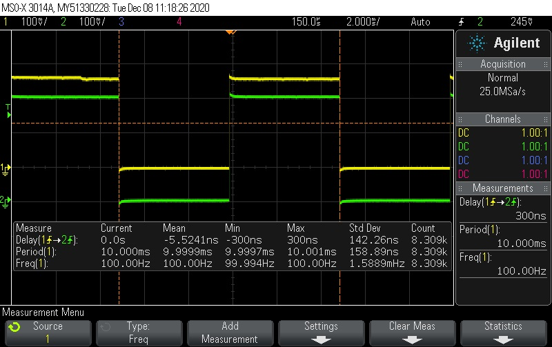

# nRF5-ble-timesync-demo
nRF52 clock synchronization demo code

## SDK version
Use the latest SDK version in this repo for the latest version of this demo.
Older SDKs are included as legacy reference.

## Demo setup
Two example applications are included, BLE central and BLE peripheral UART.
Use two nRF52-DK/nRF52840-DK and program one example onto each DK.

Note that the timing demo functionality is independent of the BLE role,
and more than two DKs can be used. In this system there is one time sync transmitter, but no limit to the number of receivers.
The same example can also be programmed to the DKs with the same time sync functionality.

## Demo usage
By default, the examples are configured to be in receiver mode, and no GPIO will be toggling.
Press Button 1 on *one* of the DKs to switch from receiver to transmitter mode.
The transmitter will begin toggling a GPIO immediately, and all 4 LEDs should light up.
When the receiver DK(s) receives the first sync packet, it will start toggling a GPIO as well.

The GPIO assignment is as follows:
nRF52-DK: P0.24
nRF52840-DK: P1.14

## Measure performance
Connect an oscilloscope or logic analyzer to the toggling GPIO and observe the delay between each GPIO edge.

